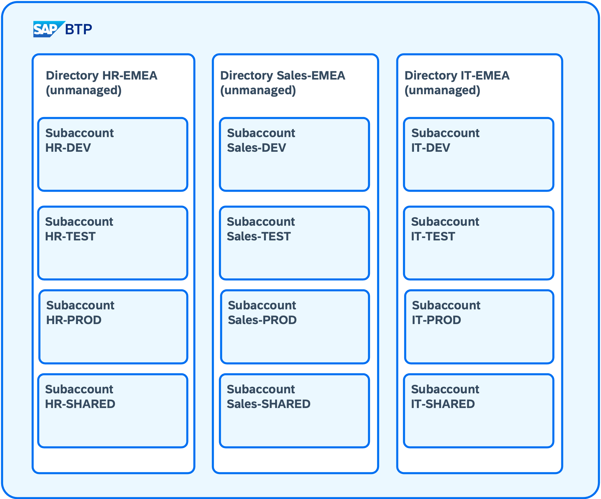

# Terraform Samples for SAP BTP Administrator's Guide

## Paradigms

We follow the paradigms of a simple and clear Terraform configuration as laid out in [Simple, Clear, Maintainable](https://rosesecurity.dev/2024/11/24/terraform-proverbs.html); especially:

- Clear is better than clever.
- Modules should be reusable, not rigid.
- Outputs are for sharing.
- Labels are free; use them liberally.
- Descriptions are for users.
- Use positive variable names to avoid double negatives.
- Name with underscores, not dashes.
- Using locals makes code descriptive and maintainable.

It's important to avoid a monolithic Terraform state (*"Terralith"*). Because of that, we don't provide a single Terraform configuration for a complete SAP BTP account. Instead, we split the setup in configurations that are provisioned and managed separately.

## Overview

The basic setup showcases the setup of directories and subaccounts as given in this overview:

## Setup of Directories

The folder `basic-setup/directory-setup` contains the setup of directories as a structuring element for the subaccounts. For details, see [README.md](./basic-setup/directory-setup/README.md).

## Setup of Subaccounts

The folder `basic-setup/subaccount-setup` contains the setup of subaccounts. For details, see the [README.md](./basic-setup/subaccount-setup/README.md) file.

## Modules

We want to keep our Terraform configuration as simple and concise as possible. To achieve this we encapsulate resusable parts of the setup in [modules](https://developer.hashicorp.com/terraform/language/modules). This allows us to reuse the modules in different setups and to keep the configuration DRY (*Don't repeat yourself*). A benefit of this approach is that we can centrally manage governance topics like naming conventions and labeling strategies for all setups.

You find the modules in the folder "modules". Learn about the modules and their usage in their respective `README` files.

### Naming Conventions and Labeling

Consistent naming conventions are one import aspect when provisioning and managing your SAP BTP account. Our samples follow the [Naming Conventions for SAP BTP Accounts](https://help.sap.com/docs/btp/btp-admin-guide/naming-conventions-for-sap-btp-accounts).

To ensure consistent naming of your resources, we encapsulate the guidelines in a dedicated module. Besides the naming, we also include the labels that can be attached to some resources on SAP BTP.

We have created one module for the level of the [directory](./modules/sap-btp-naming-conventions-directory/README.md) and one for the level of the [subaccount](./modules/sap-btp-naming-conventions-subaccount/README.md).

### Directory Setup

The module [base-directory-setup](./modules/base-directory-setup/README.md) is used to create the directories. It combines the corresponding module containing the naming and labeling conventions for a directory, and calls the Terraform resource [btp_directory](https://registry.terraform.io/providers/SAP/btp/latest/docs/resources/directory).

### Subaccount Setup

The reusable parts of the subaccount setup are:

- The module [SAP BTP - Default Subaccount Entitlements](./modules/sap-btp-subaccount-default-entitlements/README.md) encapsulates the default entitlements for SAP BTP subaccounts. It distinguishes between the different development stages of the environment (Dev, Test, Prod, Shared) and provides the default data of entitlements for each stage. The entitlement is executed in the configuration of the [basic setup of the subaccount](./basic-setup/directory-setup/README.md)
- The creation of the different SAP BTP environments are encapsulated in modules for [Cloud Foundry](./modules/sap-btp-environment/cloudfoundry/README.md) and [Kyma](./modules/sap-btp-environment/kyma/README.md).
