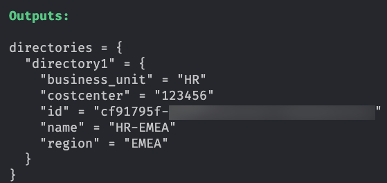

# Sample Setup for a Basic Directory Structure

## Assumptions

- We assume that we use the directories as structuring element for the subaccounts; that is, in an unmanaged fashion.
- We assume that we do the directory setup in one run for all involved departments.

## Design Decisions

We decouple the directory creation (the setup of the basic structure) from the creation of the operational units (the subaccounts within the directories). Typically, changes on directory level happen less frequently than changes in the subaccounts additionally depending on their stage. We want to avoid side effects as well as lengthy state refreshes and keep the state of the directories separate.

## Directory Setup

To create the directories, we use a map of objects that define the business data relevant for a directory, such as the following:

- business_unit (`string`): The business unit that owns the directory, such as HR, IT, or Sales
- costcenter (`string`): The cost center of the business unit
- directory_contacts (`list(string)`): The list of email addresses representing the directory contacts
- region (`string`): The geographical region of the directory, for example, EMEA

This is input data is reflected by the variables defined in the [variables.tf](./variables.tf) file.

The directories are provisioned with the [main.tf](./main.tf) file, which delegates to the module [base-directory-setup](../../modules/base-directory-setup/README.md). This module combines the corresponding module containing the naming and labeling conventions for a directory, and calls the Terraform resource [btp_directory](https://registry.terraform.io/providers/SAP/btp/latest/docs/resources/directory).

After provisioning the output, it summarizes the executed setup as given by the [outputs.tf](./outputs.tf) file. See the following example how the output could look like:

<!-- screenshots are disencouraged because they're harder to keep up to date  -->

```json
Outputs:

directories = {
  "directory1" = {
    "business_unit" = "HR"
    "costcenter" = "123456"
    "id" = "cf12345f-1234567890"
    "name" = "Sales-EMEA"
    "region" = "EMEA"
  }
}
```

## SAP BTP Administrator's Guide - References

- [Naming and Directory Templates](https://help.sap.com/docs/btp/btp-admin-guide/naming-directory-templates)
